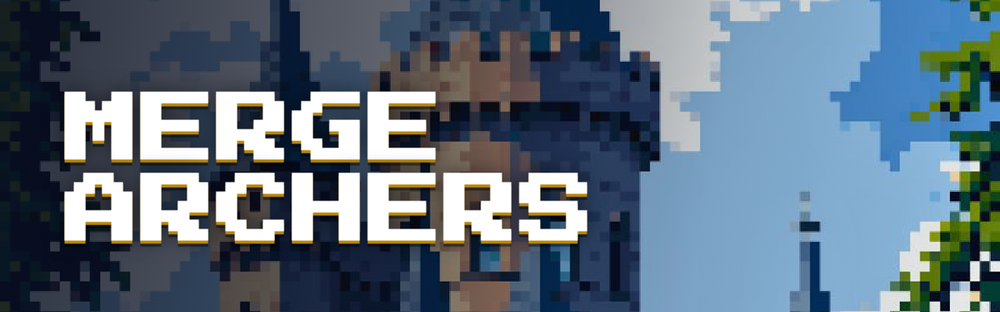

# MERGE ARCHERS — Kingdom Defense ($MARC)

Pixel wall-defense browser game with a live global leaderboard, spectate mode,
and $MARC victory-point rewards. Built as a Next.js static export + PHP API —
runs entirely on shared Hostinger hosting (no Node.js server needed).

- **Live domain:** mergearcher.xyz
- **Token:** $MARC — launching on pump.fun **July 15, 2026 · 4:30 PM UTC**
- **Rewards:** victory points convert to $MARC after launch — 100,000,000 $MARC total bonus pool

---

## 1. Deploy to Hostinger (once)

1. hPanel → **File Manager** → open `public_html`.
2. Upload `mergearchers-public_html.zip` → right-click → **Extract** (files land at the root).
3. hPanel → **Databases → MySQL Databases**: make sure the database in
   `api/config.php` exists (`u518652898_MergeArcher`). The scores table is
   created automatically on the first request.
4. Open the domain — done. Favicon, game, leaderboard and docs all work.

> `.htaccess` already blocks direct access to `api/config.php` and sets
> long-cache headers for hashed assets.

## 2. Update CA / socials / Buy button — `config.js`

Everything you'll want to edit at launch time lives in **one file**: `config.js`.

```js
window.SITE_CONFIG = {
  contractAddress: "",              // ← paste your CA here (empty = "coming soon")
  buyUrl: "https://pump.fun",       // ← optional custom Buy link
  socials: {
    x:        "https://x.com/Mergearchers",
    telegram: "https://t.me/drum_boy123",
    github:   "https://github.com/MergeArcher/merge-archers"
  }
};
```

Edit → save → re-upload **only `config.js`**. No rebuild needed. When
`contractAddress` is set:

- the ticker countdown disappears and the **CA pill** (click-to-copy) takes its place;
- the **Buy** button automatically points to `https://pump.fun/coin/<CA>`
  (unless you set a custom `buyUrl`, which always wins).

## 3. What's in the box

| Path | What it is |
| --- | --- |
| `index.html` | Landing page — full-screen hero, one-row ticker ($MARC · CA · countdown · Buy), rewards banner |
| `play/` | The game — aspect-ratio-safe stage, HUD strip below (command bar + dock-style shop), live leaderboard sidebar with **Watch live battles** |
| `leaderboard/` | Global leaderboard — stats, podium, live battles with **spectate replay viewer**, per-player View cards |
| `docs/` | Docs — how to play, victory points → $MARC, token, FAQ |
| `api/leaderboard.php` | Score API (PHP + MySQL, seeded so the board never looks empty; real runs outrank seeds) |
| `api/config.php` | Database credentials (kept out of the webroot listing, denied by `.htaccess`) |
| `config.js` | **The only file you edit** — CA, Buy URL, social links |
| `custom.css` / `custom-game.js` / `config-apply.js` | Site-wide layout, spectate engine, config wiring (don't edit) |
| `logo.jpeg` | Favicon (all pages) |
| `banner.png` | GitHub banner — the hero section look, title only (1280×400) |
| `assets/` | Game sprites & audio — archer sprites include the shades + cape look |
| `PRD.md` | Product requirements document (current state) |

## 4. Character

The royal archer rocks **black shades and a black cape** — baked directly into
the sprite sheets (`assets/tiny/archer_idle.png`, `archer_attack.png`), so the
look is consistent in-game, in the hero avatar and in the spectate viewer.
Pristine original sprites are kept outside the deploy in `sprites-backup/`.

## 5. Notes

- The leaderboard database key stays `kingdom-archers` — do not change it or
  existing scores disappear.
- All pages are static; the only server code is `api/leaderboard.php`.
- Local preview: `python3 -m http.server` in this folder (leaderboard falls
  back to the seeded roster because PHP isn't running — that's expected).
